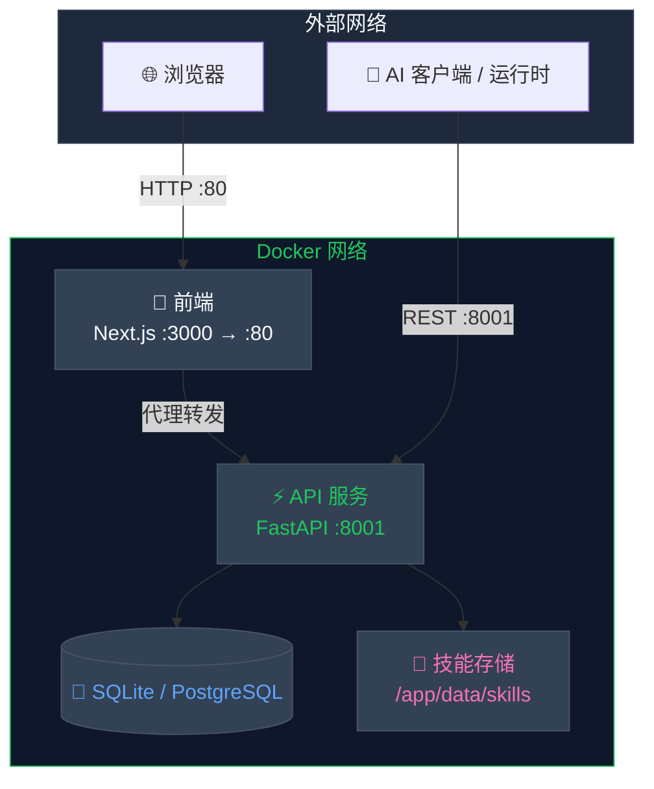
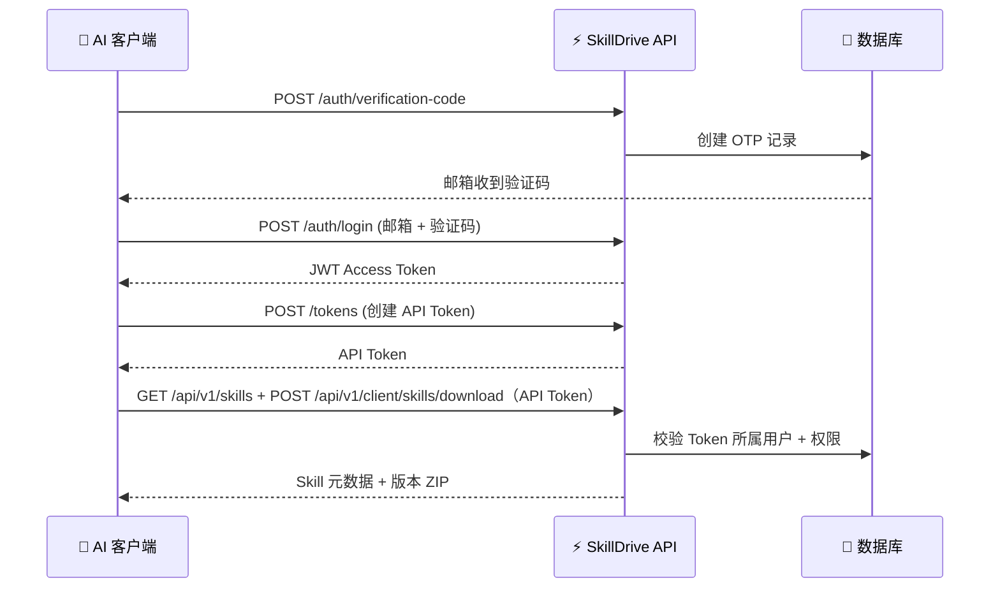

<p align="center">
  
</p>

<h1 align="center">SkillDrive</h1>

<p align="center">
  <strong>面向 AI Agent 的 Skills 管理与分发 SaaS 平台</strong>
</p>

<p align="center">
  <em>集中管理 · 版本控制 · 安全分发 — 你的 AI Agent 技能，尽在掌控</em>
</p>

<p align="center">
  <a href="https://pypi.org/project/skilldrive/"></a>
  <a href="https://pypi.org/project/skilldrive/"></a>
  <a href="https://hub.docker.com/"></a>
  <a href="./LICENSE"></a>
  <a href="https://github.com/jiabai/skilldrive"></a>
</p>

<p align="center">
  简体中文 | <a href="./README.md">English</a>
</p>

---

## 📑 目录

- [✨ 项目简介](#-项目简介)
- [🎯 为什么选择 SkillDrive](#-为什么选择-skilldrive)
- [🤖 支持的 Agent](#-支持的-agent)
- [🚀 快速开始](#-快速开始)
  - [Docker 部署](#docker-部署推荐)
  - [手动安装](#手动安装)
  - [桌面客户端](#桌面客户端)
- [🎯 核心功能](#-核心功能)
- [🏗️ 架构图](#️架构图)
- [🔌 客户端运行时接入流程](#-客户端运行时接入流程)
- [📁 存储结构](#-存储结构)
- [📊 服务端口说明](#-服务端口说明)
- [🔐 核心 API 端点](#-核心-api-端点)
- [🛠️ 技术栈](#️技术栈)
- [📚 文档资源](#-文档资源)
- [🗺️ 路线图](#️路线图)
- [🤝 参与贡献](#-参与贡献)
- [📄 许可证](#-许可证)

---

## ✨ 项目简介

**SkillDrive** 是一个**私有化 Skills 管理 SaaS 平台**，专为 AI Agent 打造。它聚焦完整的**上传 → 管理 → 分发**闭环能力，提供多租户隔离、可视化 Web 控制台，以及面向客户端运行时的 REST 分发接口。

```
┌─────────────┐     ┌──────────────┐     ┌──────────────┐     ┌──────────────┐
│   上传       │────▶│   管理       │────▶│   版本       │────▶│   分发       │
│  Skill ZIP   │     │  组织与编排   │     │  控制与回滚   │     │  通过 REST   │
└─────────────┘     └──────────────┘     └──────────────┘     └──────────────┘
```

---

## 🎯 为什么选择 SkillDrive

| 痛点 | 解决方案 |
|------|---------|
| 🔀 技能散落在各处仓库 | 📦 集中式私有技能存储 |
| 🔓 AI Agent 无访问控制 | 🔐 Web 用 JWT，客户端用 API Token |
| 🖐️ 手动分发技能繁琐 | 🖥️ Web 控制台 + REST 下载分发 |
| 📉 缺乏版本追踪 | 📌 内置版本管理与回滚 |
| 🏢 缺乏企业级隔离 | 🏛️ 多租户 + RBAC + 组织架构模型 |

---

## 🤖 支持的 Agent

SkillDrive 支持向所有主流 AI 编程 Agent 分发技能：

| Agent | 技能路径 | 桌面客户端 |
|-------|---------|-----------|
| **Claude Code** | `~/.claude/skills` | ✅ |
| **Codex** | `~/.agents/skills` | ✅ |
| **Gemini CLI** | `~/.gemini/skills` | ✅ |
| **Cursor** | `~/.cursor/skills` | ✅ |
| **Windsurf** | `~/.codeium/windsurf/skills` | ✅ |
| **GitHub Copilot** | `~/.copilot/skills` | ✅ |
| **RooCode** | `~/.roo/skills` | ✅ |
| **Cline** | `~/.agents/skills` | ✅ |
| **OpenCode** | `~/.config/opencode/skills` | ✅ |
| **KiloCode** | `~/.kilocode/skills` | ✅ |
| **Amp** | `~/.config/agents/skills` | ✅ |
| **Kiro** | `~/.kiro/skills` | ✅ |
| **Warp** | `~/.agents/skills` | ✅ |
| **Trae** | `~/.trae/skills` | ✅ |
| **Factory** | `~/.factory/skills` | ✅ |
| **Kimi Code CLI** | `~/.config/agents/skills` | ✅ |
| **Mistral Le Chat** | `~/.vibe/skills` | ✅ |
| **Pi Coding Agent** | `~/.pi/agent/skills` | ✅ |
| **Antigravity** | `~/.gemini/antigravity/skills` | ✅ |
| **OpenClaw** | `~/.openclaw/skills` | ✅ |
| **CodeBuddy** | `~/.codebuddy/skills` | ✅ |
| **WorkBuddy** | `~/.workbuddy/skills` | ✅ |
| **Hermes Agent** | `~/.hermes/skills` | ✅ |
| **QwenWork CN** | `~/.qwenworkcn/skills` | ✅ |

> 💡 桌面客户端可自动检测已安装的 Agent，并以「先审核、后分发」的工作流管理技能分发。各 Agent 的技能目录可在客户端内的路径设置中覆盖。

---

## 🚀 快速开始

### 环境要求

- **Python 3.13+**
- **Node.js 18+**（前端，可选）
- **Docker**（推荐）

> **数据库**：默认使用 SQLite（零配置开箱即用）。生产环境推荐 PostgreSQL 14+，详见[部署指南](docs/deployment-zh.md)。

### Docker 部署（推荐）

默认 Compose 走的是生产型基线：SQLite 使用 named volume，日志输出到 stdout/stderr，不需要宿主机上的 `./data` 或 `./logs` 目录。

```bash
git clone https://github.com/jiabai/skilldrive.git
cd skilldrive
cp backend/.env.example backend/.env
# 编辑 backend/.env — 至少需要修改 SECRET_KEY 为 32 位以上的随机字符串
# 示例：python -c "import secrets; print(secrets.token_urlsafe(32))"
UV_DEFAULT_INDEX=https://pypi.tuna.tsinghua.edu.cn/simple uv lock
python scripts/sync_shared_catalogs.py --check
docker compose up -d --build migrate api webui
```

<details>
<summary><strong>🔧 局域网 / 域名访问</strong></summary>

如果前端不是通过 `localhost` 访问，而是通过局域网 IP 或域名访问，请在启动前把 `NEXT_PUBLIC_API_BASE_URL` 设成对应的公网地址。

</details>

<details>
<summary><strong>🧪 热重载开发覆盖层</strong></summary>

如果你要使用测试预发的热重载覆盖层，需要把源码、数据和日志都映射到宿主机：

```bash
mkdir -p ./data ./logs
cp .env.preprod.example .env.preprod
# 如果不是 localhost 或者宿主机 UID/GID 不是 1000:1000，请修改 .env.preprod
docker compose --env-file .env.preprod -f docker-compose.yml -f docker-compose.dev.yml up -d --build migrate api webui
```

如果你不是通过 `localhost` 打开前端，而是通过局域网 IP 或域名访问，请把 `.env.preprod` 里的 `NEXT_PUBLIC_API_BASE_URL` 改成对应的公网地址。这个覆盖层会继续启用 `uvicorn --reload` 和 `next dev`，并把 `./backend`、`./frontend`、`./data`、`./logs` 挂进容器，后端日志会写到 `./logs/api.log`。

</details>

完成后可通过反向代理访问，或直接在宿主机上访问 `http://127.0.0.1:3000` 打开 Web 控制台。

> **注意**：后端镜像使用多阶段构建。在低配置主机上，第一次执行 `docker compose up -d --build` 仍然可能需要几分钟。只要 Docker 的构建缓存还在，后续重建通常会快很多。

### 手动安装

```bash
# 1. 创建虚拟环境
uv venv
source .venv/bin/activate  # Linux/macOS
# .venv\Scripts\activate   # Windows

# 2. 安装依赖
uv sync --locked --extra dev
python scripts/sync_shared_catalogs.py --check

# 3. 配置环境变量
cp backend/.env.example backend/.env
# 编辑 backend/.env — 至少需要修改 SECRET_KEY 为 32 位以上的随机字符串

# 4. 初始化数据库
uv run alembic -c backend/alembic.ini upgrade head

# 5. 启动服务
uv run uvicorn backend.api_app:app --host 0.0.0.0 --port 8001
```

<details>
<summary><strong>💡 Windows 开发提示</strong></summary>

仓库默认使用项目内的 `.venv`，这样更适合 Linux 部署、Docker 和 CI。如果你在 Windows 上希望复用类似 `D:\Code\.venv` 这样的机器级虚拟环境，请只在本地设置 `UV_PROJECT_ENVIRONMENT`，不要把这类绝对路径写入仓库。

如果你修改了 `shared/user-statuses.json`，请执行 `python scripts/sync_shared_catalogs.py --write`，并把 `backend/domain/` 与 `frontend/src/generated/` 下同步后的副本一起提交。

</details>

### 桌面客户端

仓库中还包含一个跨平台 Electron 桌面客户端，位于 `desktop-client/`。它会轮询后端中的待审核技能更新，显示托盘提示和桌面通知，但不会自动分发，保持"先审核、后操作"的流程。

```bash
cd desktop-client
npm install
set SKILLDRIVE_API_BASE_URL=http://127.0.0.1:8001
set SKILLDRIVE_API_TOKEN=ask_live_your_token
set SKILLDRIVE_POLL_INTERVAL_MS=30000
npm test
npm run build
```

| 功能 | 说明 |
|------|------|
| 🛡️ **先审核后同步** | 轮询后端更新，安装前需要明确审批 |
| 📤 **本地技能上传** | 扫描本地 Agent 目录，上传服务器上缺失的技能 |
| 🌗 **深色/浅色主题** | 一键主题切换并持久化 |
| 🤖 **多 Agent 支持** | 分发给 Claude Code、Codex、Gemini CLI、Cursor、Windsurf、Copilot |
| 📦 **跨平台打包** | Windows 安装包和 macOS DMG（已签名、公证、装订） |
| 📌 **系统托盘驻留** | 窗口关闭后应用在后台继续轮询 |
| 🔐 **加密下载支持** | 可使用后端密钥解密技能包 |

<details>
<summary><strong>⚡ 桌面端快速命令</strong></summary>

```bash
cd desktop-client

# 完整桌面运行时（推荐用于本地测试）
npm run start:electron

# 仅渲染器开发（更快的 UI 迭代）
npm run dev

# 运行测试
npm test

# 构建 Windows 版本（生成 NSIS 安装包）
npm run dist:win

# 构建 macOS 版本（需要 Apple 凭证进行签名/公证）
npm run dist:mac
```

关闭窗口后托盘会继续保活，这样后台轮询可以持续运行，而已审核的更新只有在你明确触发分发时才会真正写入各个 agent 目录。完整的手动测试指南和故障排查请参考 `desktop-client/README-zh.md`。

</details>

---

## 🎯 核心功能

### 多租户架构

每位用户拥有独立的技能空间，并采用清晰的认证边界：Web 控制台使用 JWT，客户端分发访问使用 API Token。

### 完整的技能生命周期

```
上传 ZIP → 解析 SKILL.md → 版本管理 → 启用 → 下载
     ↑                                   |
     └────────────────── 回滚 / 停用 ←───┘
```

### 本地技能上传

从你的 Agent 目录上传现有的本地技能：

- 从 Claude Code、Codex、Gemini CLI、Cursor、Windsurf、Copilot 等扫描本地技能包
- 按 SKILL 名称对比本地技能与服务器库存
- 上传服务器上缺失的有效本地技能
- 上传后刷新库存以验证服务器状态

### 企业级安全保障（后端能力开关）

以下能力由后端环境变量控制，并通过 `/api/v1/runtime-config` 下发给前端控制台。

| 功能 | 环境变量 | 说明 |
|------|---------|------|
| **RBAC** | `ENABLE_RBAC` | 基于角色的细粒度权限管理 |
| **组织架构模型** | `ENABLE_ORG_MODEL` | 企业 → 团队 → 用户三级层级 |
| **审计日志** | `ENABLE_AUDIT_LOG` | 完整操作记录，支持导出 |
| **SSO 单点登录** | `ENABLE_SSO` | 基于 OIDC Authorization Code + PKCE |
| **LDAP** | `ENABLE_LDAP` | LDAP 目录认证 |
| **邮箱验证** | `ENABLE_EMAIL_OTP_LOGIN` | OTP 登录 + 验证码校验（默认启用） |

> 前端不再单独维护一套业务能力开关，页面功能是否展示以服务端下发的 runtime capability contract 为准。

### REST 优先的技能分发

默认产品路径是集中管理 Skill，并通过 REST 向客户端分发：

| 能力 | 用途 |
|------|------|
| 技能管理 API | 创建、更新、启用和版本化 Skill |
| 技能下载 API | 下载指定版本 ZIP |
| 认证与 API Token | 控制客户端可访问的 Skill |
| Web 控制台 | 浏览、管理和分发 Skill |

---

## 🏗️ 架构图



所有外部流量通过前端（端口 80）进入，由前端内部代理转发 API 请求。客户端运行时也可直接连接 API 服务（端口 8001），完成认证、查询 Skill 元数据并下载版本包。

### 项目结构

```
skilldrive/
├── backend/           # FastAPI API 服务、业务逻辑、模型、迁移
├── frontend/          # Next.js Web 控制台（TypeScript + Tailwind）
├── desktop-client/    # Electron 桌面同步客户端
├── shared/            # 构建时共享的 JSON 数据
├── tests/             # 后端 pytest 测试套件
├── deploy/            # Nginx 和部署资源
├── docs/              # 规格说明、执行计划、参考文档
└── scripts/           # 工具脚本
```

---

## 🔌 客户端运行时接入流程

客户端运行时通过 REST 接入 SkillDrive：

1. **登录** Web 控制台并获取 JWT Access Token
2. **创建 API Token**：调用 `/api/v1/tokens`
3. **查询与下载**：使用 API Token 查询 Skill 元数据并调用 `/api/v1/client/skills/download` 下载指定版本
4. **处理产物**：在客户端本地按自身运行时策略处理已下载内容

### 认证流程



---

## 📁 存储结构

```
/app/data/skills/
├── {user_id_1}/
│   ├── pdf/
│   │   ├── SKILL.md          # 技能指令文件
│   │   └── reference.md      # 参考文档
│   └── xlsx/
│       └── SKILL.md
├── {user_id_2}/
│   └── pdf/
│       └── SKILL.md
└── ...
```

每个用户目录完全隔离，仅能访问自己的技能空间，确保数据安全。

---

## 📊 服务端口说明

| 服务 | 端口 | 说明 | 访问范围 |
|------|------|------|---------|
| **前端** | 80 | Web 控制台 (Next.js) | 对外开放 |
| **API 服务** | 8001 | 后端 API (FastAPI) | 对外开放（REST） |

> **注意**：默认 Docker 部署使用 SQLite，无需额外数据库服务。如需使用 PostgreSQL，请在 `docker-compose.yml` 中添加 `db` 服务，详见[部署指南](docs/deployment-zh.md)。

---

## 🔐 核心 API 端点

<details>
<summary><strong>🔑 认证模块</strong></summary>

| 方法 | 端点 | 说明 |
|------|------|------|
| POST | `/api/v1/auth/verification-code` | 发送邮箱验证码 |
| POST | `/api/v1/auth/register` | 用户注册 |
| POST | `/api/v1/auth/login` | 用户登录 |
| POST | `/api/v1/auth/refresh` | 刷新访问令牌 |
| GET | `/api/v1/auth/sso/authorize` | 发起 OIDC Authorization Code + PKCE 流程 |
| GET | `/api/v1/auth/sso/callback` | 完成 OIDC 回调并签发应用令牌 |
| POST | `/api/v1/auth/ldap/login` | LDAP 登录 |
| POST | `/api/v1/auth/logout` | 用户登出 |

</details>

<details>
<summary><strong>📦 技能管理</strong></summary>

| 方法 | 端点 | 说明 |
|------|------|------|
| GET | `/api/v1/skills` | 获取技能列表（仅 API Token） |
| GET | `/api/v1/skills/public` | 获取公开技能列表 |
| GET | `/api/v1/skills/public/{id}` | 获取公开技能详情 |
| GET | `/api/v1/skills/cache-policy` | 获取技能缓存策略 |
| POST | `/api/v1/skills` | 创建新技能 |
| POST | `/api/v1/skills/upload` | 上传技能 ZIP 包 |
| POST | `/api/v1/client/skills/download` | 下载技能包（加密，仅 API Token） |
| GET | `/api/v1/skills/{id}` | 获取技能详情（仅 API Token） |
| PUT | `/api/v1/skills/{id}` | 更新技能 |
| DELETE | `/api/v1/skills/{id}` | 删除技能 |
| POST | `/api/v1/skills/{id}/reference` | 添加参考文件 |
| POST | `/api/v1/skills/{id}/clone` | 克隆技能 |
| PUT | `/api/v1/skills/{id}/pin` | 置顶技能 |
| PUT | `/api/v1/skills/{id}/unpin` | 取消置顶 |
| POST | `/api/v1/skills/{id}/activate` | 启用技能 |
| POST | `/api/v1/skills/{id}/deactivate` | 停用技能 |
| GET | `/api/v1/skills/{id}/versions` | 版本历史（仅 API Token） |
| GET | `/api/v1/skills/{id}/versions/diff` | 版本差异对比 |
| GET | `/api/v1/skills/{id}/versions/{version}` | 获取指定版本（仅 API Token） |
| GET | `/api/v1/skills/{id}/versions/{version}/install-instructions` | 安装说明（仅 API Token） |
| POST | `/api/v1/skills/{id}/versions/{version}/rollback` | 版本回滚 |
| GET | `/api/v1/skills/{id}/files` | 列出技能文件 |
| GET | `/api/v1/skills/{id}/files/{path}` | 读取技能文件 |

</details>

<details>
<summary><strong>🎫 Token 管理</strong></summary>

| 方法 | 端点 | 说明 |
|------|------|------|
| GET | `/api/v1/tokens` | 获取 Token 列表 |
| POST | `/api/v1/tokens` | 创建 API Token |
| DELETE | `/api/v1/tokens/{id}` | 撤销 API Token |

</details>

<details>
<summary><strong>📊 仪表盘</strong></summary>

| 方法 | 端点 | 说明 |
|------|------|------|
| GET | `/api/v1/dashboard/overview` | 仪表盘概览统计 |
| POST | `/api/v1/dashboard/metrics/cleanup` | 清理历史指标 |
| POST | `/api/v1/dashboard/metrics/reset-24h` | 重置 24 小时指标 |

</details>

<details>
<summary><strong>📋 审计日志</strong></summary>

| 方法 | 端点 | 说明 |
|------|------|------|
| GET | `/api/v1/audit/logs` | 查询审计日志 |
| POST | `/api/v1/audit/logs/export` | 导出日志 |

</details>

> 完整 API 文档：启动服务后访问 `/docs`（FastAPI 自动生成的 Swagger UI）

---

## 🛠️ 技术栈

| 层面 | 技术 |
|------|------|
| **后端** | Python 3.13+, FastAPI, SQLAlchemy (async) |
| **数据库** | SQLite（默认）/ PostgreSQL 14+ (asyncpg) |
| **前端** | Next.js 14, TypeScript, Tailwind CSS, shadcn/ui |
| **桌面端** | Electron, React, TypeScript, Vite |
| **认证** | JWT (PyJWT), OTP 邮箱验证, SSO (OIDC), LDAP |
| **存储** | 本地文件系统 / S3 (boto3) |
| **部署** | Docker Compose, Nginx 反向代理 |
| **协议** | REST (HTTP) |
| **日志** | Loguru |

---

## 📚 文档资源

| 资源 | 说明 |
|------|------|
| [架构地图](docs/ARCHITECTURE.md) | 仓库代码地图、层级边界与关键文件 |
| [设计规范](docs/DESIGN.md) | 后端、前端与文档的稳定设计约束 |
| [安全规范](docs/SECURITY.md) | 认证、密钥、隔离边界与安全待办 |
| [部署指南](docs/deployment-zh.md) | 生产环境部署教程 |
| [产品规格索引](docs/product-specs/index.md) | 面向用户能力的规格说明入口 |
| [执行计划索引](docs/exec-plans/index.md) | 当前工作流、历史计划与技术债入口 |

---

## 🗺️ 路线图

- [ ] **公开技能市场** — 分享和发现社区技能
- [ ] **技能依赖图** — 可视化技能依赖关系与冲突
- [ ] **实时同步** — 基于 WebSocket 的技能更新推送通知
- [ ] **插件系统** — 可扩展的中间件用于自定义技能处理
- [ ] **多语言 SDK** — Python、TypeScript、Go 客户端库
- [ ] **CI/CD 集成** — GitHub Actions、GitLab CI 技能部署流水线

> 详见[产品规格](docs/product-specs/index.md)和[执行计划](docs/exec-plans/index.md)了解当前工作流。

---

## 🤝 参与贡献

欢迎提交 Issue 和 Pull Request！贡献流程：

1. **Fork** 本仓库
2. **创建** 功能分支 (`git checkout -b feature/amazing-feature`)
3. **提交** 更改 (`git commit -m 'Add amazing feature'`)
4. **推送** 到分支 (`git push origin feature/amazing-feature`)
5. **发起** Pull Request

提交前请阅读 [WORKFLOW.md](WORKFLOW.md) 了解项目工作流，并参考 [docs/EXECUTION_GATES.md](docs/EXECUTION_GATES.md) 确保通过执行门禁。

### 开发命令

```bash
# 后端
uv sync --locked --extra dev
uv run alembic -c backend/alembic.ini upgrade head
uv run uvicorn backend.api_app:app --host 0.0.0.0 --port 8001
uv run pytest
uv run ruff check .
uv run mypy backend

# 前端
cd frontend && npm install
cd frontend && npm run dev
cd frontend && npm run build
cd frontend && npm run lint
cd frontend && npm test

# Docker
docker compose up -d --build migrate
docker compose up -d api webui
docker compose logs -f
```

---

## 📄 许可证

本项目采用 **Apache License 2.0** 开源协议 —— 详情请参阅 [LICENSE](./LICENSE) 文件。

---

<p align="center">
  <sub>为 AI 开发者社区用心构建 ❤️</sub>
</p>

<p align="center">
  <a href="https://github.com/jiabai/skilldrive/stargazers">
    
  </a>
</p>
