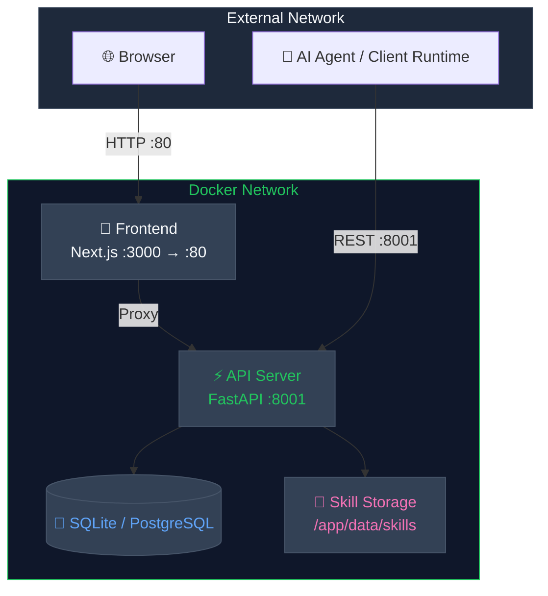
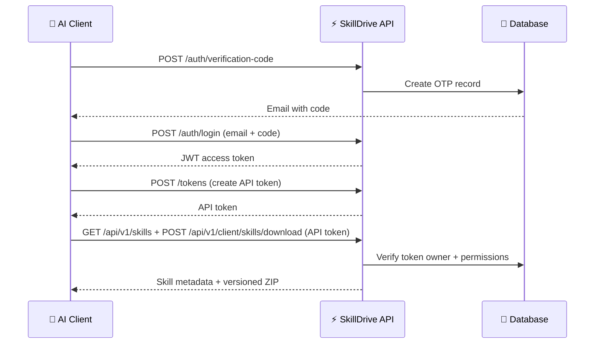

<p align="center">
  
</p>

<h1 align="center">SkillDrive</h1>

<p align="center">
  <strong>Skills Management & Distribution Platform for AI Agents</strong>
</p>

<p align="center">
  <em>Centralize · Version · Distribute — Your AI Agent Skills, Under Your Control</em>
</p>

<p align="center">
  <a href="https://pypi.org/project/skilldrive/"></a>
  <a href="https://pypi.org/project/skilldrive/"></a>
  <a href="https://hub.docker.com/"></a>
  <a href="./LICENSE"></a>
  <a href="https://github.com/jiabai/skilldrive"></a>
</p>

<p align="center">
  <a href="./README-zh.md">简体中文</a> | English
</p>

---

## 📑 Table of Contents

- [✨ Overview](#-overview)
- [🎯 Why SkillDrive](#-why-skilldrive)
- [🤖 Supported Agents](#-supported-agents)
- [🚀 Quick Start](#-quick-start)
  - [Docker Setup](#docker-setup-recommended)
  - [Manual Installation](#manual-installation)
  - [Desktop Client](#desktop-client)
- [🎯 Core Features](#-core-features)
- [🏗️ Architecture](#️-architecture)
- [🔌 Client Runtime Flow](#-client-runtime-flow)
- [📁 Storage Structure](#-storage-structure)
- [📊 Services & Ports](#-services--ports)
- [🔐 Key API Endpoints](#-key-api-endpoints)
- [🛠️ Tech Stack](#️-tech-stack)
- [📚 Documentation](#-documentation)
- [🗺️ Roadmap](#️-roadmap)
- [🤝 Contributing](#-contributing)
- [📄 License](#-license)

---

## ✨ Overview

**SkillDrive** is a **private Skills management SaaS platform** purpose-built for AI agents. It focuses on the complete workflow of **upload → manage → distribute** with multi-tenant isolation, a modern web console, and REST APIs for distributing versioned skills to client-side runtimes.

```
┌─────────────┐     ┌──────────────┐     ┌──────────────┐     ┌──────────────┐
│   Upload     │────▶│   Manage     │────▶│   Version    │────▶│  Distribute  │
│  Skill ZIP   │     │  & Organize  │     │  & Rollback  │     │  via REST    │
└─────────────┘     └──────────────┘     └──────────────┘     └──────────────┘
```

---

## 🎯 Why SkillDrive

| Challenge | Solution |
|-----------|----------|
| 🔀 Skills scattered across repositories | 📦 Centralized private skill storage |
| 🔓 No access control for AI agents | 🔐 JWT for web + API tokens for clients |
| 🖐️ Manual skill deployment | 🖥️ Web console + REST-based distribution |
| 📉 No version tracking | 📌 Built-in versioning & rollback |
| 🏢 No enterprise-grade isolation | 🏛️ Multi-tenant with RBAC & org model |

---

## 🤖 Supported Agents

SkillDrive distributes skills to all major AI coding agents:

| Agent | Skill Path | Desktop Client |
|-------|-----------|----------------|
| **Claude Code** | `~/.claude/skills` | ✅ |
| **Codex** | `~/.agents/skills` | ✅ |
| **Gemini CLI** | `~/.gemini/skills` | ✅ |
| **Cursor** | `~/.cursor/skills` | ✅ |
| **Windsurf** | `~/.codeium/windsurf/skills` | ✅ |
| **GitHub Copilot** | `~/.copilot/skills` | ✅ |
| **RooCode** | `~/.roo/skills` | ✅ |
| **Cline** | `~/.agents/skills` | ✅ |
| **OpenCode** | `~/.config/opencode/skills` | ✅ |
| **KiloCode** | `~/.kilocode/skills` | ✅ |
| **Amp** | `~/.config/agents/skills` | ✅ |
| **Kiro** | `~/.kiro/skills` | ✅ |
| **Warp** | `~/.agents/skills` | ✅ |
| **Trae** | `~/.trae/skills` | ✅ |
| **Factory** | `~/.factory/skills` | ✅ |
| **Kimi Code CLI** | `~/.config/agents/skills` | ✅ |
| **Mistral Le Chat** | `~/.vibe/skills` | ✅ |
| **Pi Coding Agent** | `~/.pi/agent/skills` | ✅ |
| **Antigravity** | `~/.gemini/antigravity/skills` | ✅ |
| **OpenClaw** | `~/.openclaw/skills` | ✅ |
| **CodeBuddy** | `~/.codebuddy/skills` | ✅ |
| **WorkBuddy** | `~/.workbuddy/skills` | ✅ |
| **Hermes Agent** | `~/.hermes/skills` | ✅ |
| **QwenWork CN** | `~/.qwenworkcn/skills` | ✅ |

> 💡 The desktop client auto-detects installed agents and manages skill distribution with a review-first workflow. Per-agent skill directories can be overridden in the app's agent path settings.

---

## �🚀 Quick Start

### Prerequisites

- **Python 3.13+**
- **Node.js 18+** (frontend, optional)
- **Docker** (recommended)

> **Database**: SQLite is used by default (zero-config). PostgreSQL 14+ is recommended for production — see [Deployment Guide](docs/deployment.md).

### Docker Setup (Recommended)

The default Compose stack is production-like: it uses a named volume for SQLite, keeps logs on stdout/stderr, and does not require host `./data` or `./logs` directories.

```bash
git clone https://github.com/jiabai/skilldrive.git
cd skilldrive
cp backend/.env.example backend/.env
# Edit backend/.env — at minimum, change SECRET_KEY to a random 32+ char string
# Example: python -c "import secrets; print(secrets.token_urlsafe(32))"
UV_DEFAULT_INDEX=https://pypi.tuna.tsinghua.edu.cn/simple uv lock
python scripts/sync_shared_catalogs.py --check
docker compose up -d --build migrate api webui
```

<details>
<summary><strong>🔧 LAN / Domain Access</strong></summary>

If you expose the frontend through a LAN IP or domain instead of `localhost`, export `NEXT_PUBLIC_API_BASE_URL` to that public origin before starting the stack.

</details>

<details>
<summary><strong>🧪 Hot-Reload Dev Overlay</strong></summary>

Mount source, data, and logs onto the host and keep code reload enabled:

```bash
mkdir -p ./data ./logs
cp .env.preprod.example .env.preprod
# Edit .env.preprod if this host is not using localhost or UID/GID 1000:1000
docker compose --env-file .env.preprod -f docker-compose.yml -f docker-compose.dev.yml up -d --build migrate api webui
```

Set `NEXT_PUBLIC_API_BASE_URL` in `.env.preprod` to your LAN IP or domain if you open the frontend through anything other than `localhost`. The overlay keeps `uvicorn --reload` and `next dev` enabled, mounts `./backend`, `./frontend`, `./data`, and `./logs`, and writes backend logs to `./logs/api.log`.

</details>

Access the web console through your reverse proxy or through the local bind at `http://127.0.0.1:3000`.

> **Note**: The backend image uses a multi-stage build. On low-resource hosts, the first `docker compose up -d --build` may take a few minutes. Later rebuilds are much faster as long as the Docker build cache is retained.

### Manual Installation

```bash
# 1. Create virtual environment
uv venv
source .venv/bin/activate  # Linux/macOS
# .venv\Scripts\activate   # Windows

# 2. Install dependencies
uv sync --locked --extra dev
python scripts/sync_shared_catalogs.py --check

# 3. Configure environment
cp backend/.env.example backend/.env
# Edit backend/.env — at minimum, change SECRET_KEY to a random 32+ char string

# 4. Initialize database
uv run alembic -c backend/alembic.ini upgrade head

# 5. Start server
uv run uvicorn backend.api_app:app --host 0.0.0.0 --port 8001
```

<details>
<summary><strong>💡 Windows Development Tips</strong></summary>

For local development, the repository default is a project-local `.venv`. If you want `uv` to use a machine-level environment such as `D:\Code\.venv` on Windows, set `UV_PROJECT_ENVIRONMENT` locally before running `uv sync`; do not commit that machine-specific path into the repository.

If you edit `shared/user-statuses.json`, run `python scripts/sync_shared_catalogs.py --write` and commit the synced copies under `backend/domain/` and `frontend/src/generated/` together with the source change.

</details>

### Desktop Client

The repository includes a cross-platform Electron desktop client under `desktop-client/`. It polls the backend for reviewable skill updates, shows tray tooltips and desktop notifications, and keeps distribution manual so operators can review before they act.

```bash
cd desktop-client
npm install
set SKILLDRIVE_API_BASE_URL=http://127.0.0.1:8001
set SKILLDRIVE_API_TOKEN=ask_live_your_token
set SKILLDRIVE_POLL_INTERVAL_MS=30000
npm test
npm run build
```

| Feature | Description |
|---------|-------------|
| 🛡️ **Review-first sync** | Polls for updates, requires explicit approval before installing |
| 📤 **Local Skills upload** | Scans local agent directories, uploads server-missing skills |
| 🌗 **Dark/Light theme** | One-click theme switching with persistence |
| 🤖 **Multi-agent support** | Distributes to Claude Code, Codex, Gemini CLI, Cursor, Windsurf, Copilot |
| 📦 **Cross-platform** | Windows installer and macOS DMG (signed, notarized, stapled) |
| 📌 **System tray** | Stays in background with polling after window closes |
| 🔐 **Encrypted downloads** | Optionally decrypts skill packages using backend secret key |

<details>
<summary><strong>⚡ Desktop Quick Commands</strong></summary>

```bash
cd desktop-client

# Full desktop runtime (recommended for local testing)
npm run start:electron

# Renderer-only development (faster UI iteration)
npm run dev

# Run tests
npm test

# Build for Windows (produces NSIS installer)
npm run dist:win

# Build for macOS (requires Apple credentials for signing/notarization)
npm run dist:mac
```

The tray keeps the app resident after the window is closed so background polling can continue, and approved updates are distributed only when you explicitly trigger them from the review UI. See `desktop-client/README.md` for complete manual testing guide and troubleshooting.

</details>

---

## 🎯 Core Features

### Multi-Tenant Architecture

Every user gets an isolated skill space with a clear auth boundary: JWT for the web console, API tokens for client-side skill distribution.

### Complete Skill Lifecycle

```
Upload ZIP → Parse SKILL.md → Version Control → Activate → Download
  ↑                                                                   │
  └───────────────────── Rollback / Deactivate ←──────────────────────┘
```

### Local Skill Upload

Upload existing local skills from your agent directories:

- Scan local skill packages from Claude Code, Codex, Gemini CLI, Cursor, Windsurf, Copilot, and more
- Compare local skills against server inventory by SKILL name
- Upload valid local skills that are missing from the server
- Refresh inventory after upload to verify server status

### Enterprise-Grade Security (Backend Capabilities)

The following features are controlled by backend environment variables and exposed to the web console through `/api/v1/runtime-config`.

| Feature | Env Flag | Description |
|---------|----------|-------------|
| **RBAC** | `ENABLE_RBAC` | Role-based access control with fine-grained permissions |
| **Organization Model** | `ENABLE_ORG_MODEL` | Enterprise → Team → User hierarchy |
| **Audit Logging** | `ENABLE_AUDIT_LOG` | Full operation trail with export capability |
| **SSO Integration** | `ENABLE_SSO` | OIDC Authorization Code + PKCE |
| **LDAP** | `ENABLE_LDAP` | LDAP directory authentication |
| **Email Verification** | `ENABLE_EMAIL_OTP_LOGIN` | OTP login and verification codes (enabled by default) |

> The frontend no longer owns a separate set of business capability flags. UI availability is derived from the backend runtime capability contract.

### REST-First Skill Distribution

The default product path is to manage skills centrally and distribute them over REST:

| Capability | Purpose |
|------------|---------|
| Skill management APIs | Create, update, activate, and version skills |
| Skill download API | Download a versioned ZIP |
| Auth + API tokens | Control which clients can fetch which skills |
| Web console | Browse, manage, and distribute skills |

---

## 🏗️ Architecture



All external traffic enters through Frontend (port 80), which proxies API requests internally. Client runtimes can also connect directly to the API server (port 8001) to create API tokens via a user session and then fetch metadata and download skills with API-token-based distribution access.

### Project Structure

```
skilldrive/
├── backend/           # FastAPI API server, services, models, migrations
├── frontend/          # Next.js web console (TypeScript + Tailwind)
├── desktop-client/    # Electron desktop sync client
├── shared/            # Build-time shared JSON data
├── tests/             # Backend pytest suite
├── deploy/            # Nginx and deployment assets
├── docs/              # Specs, plans, references, quality, security
└── scripts/           # Utility scripts
```

---

## 🔌 Client Runtime Flow

Connect your client runtime to SkillDrive over REST:

1. **Sign in** to the web console and obtain a JWT access token
2. **Create an API token** from `/api/v1/tokens`
3. **Query & download** skill metadata and versions using the API token
4. **Handle artifacts** in the client environment according to your own runtime policy

### Authentication Flow



---

## 📁 Storage Structure

```
/app/data/skills/
├── {user_id_1}/
│   ├── pdf/
│   │   ├── SKILL.md          # Skill instructions
│   │   └── reference.md      # Reference documentation
│   └── xlsx/
│       └── SKILL.md
├── {user_id_2}/
│   └── pdf/
│       └── SKILL.md
└── ...
```

Each user's directory is fully isolated — users can only access their own skills.

---

## 📊 Services & Ports

| Service | Port | Description | Access |
|---------|------|-------------|--------|
| **Frontend** | 80 | Web Console (Next.js) | Public |
| **API Server** | 8001 | Backend API (FastAPI) | Public (REST) |

> **Note**: The default Docker setup uses SQLite (no separate database service). To use PostgreSQL, add a `db` service to `docker-compose.yml` — see [Deployment Guide](docs/deployment.md).

---

## 🔐 Key API Endpoints

<details>
<summary><strong>🔑 Authentication</strong></summary>

| Method | Endpoint | Description |
|--------|----------|-------------|
| POST | `/api/v1/auth/verification-code` | Send email code |
| POST | `/api/v1/auth/register` | User registration |
| POST | `/api/v1/auth/login` | User login |
| POST | `/api/v1/auth/refresh` | Refresh access token |
| GET | `/api/v1/auth/sso/authorize` | Start OIDC Authorization Code + PKCE flow |
| GET | `/api/v1/auth/sso/callback` | Complete OIDC callback and issue app tokens |
| POST | `/api/v1/auth/ldap/login` | LDAP authentication |
| POST | `/api/v1/auth/logout` | User logout |

</details>

<details>
<summary><strong>📦 Skill Management</strong></summary>

| Method | Endpoint | Description |
|--------|----------|-------------|
| GET | `/api/v1/skills` | List all skills (API token only) |
| GET | `/api/v1/skills/public` | List public skills |
| GET | `/api/v1/skills/public/{id}` | Get public skill details |
| GET | `/api/v1/skills/cache-policy` | Get skill cache policy |
| POST | `/api/v1/skills` | Create new skill |
| POST | `/api/v1/skills/upload` | Upload skill ZIP |
| POST | `/api/v1/client/skills/download` | Download skill package (encrypted, API token only) |
| GET | `/api/v1/skills/{id}` | Get skill details (API token only) |
| PUT | `/api/v1/skills/{id}` | Update skill |
| DELETE | `/api/v1/skills/{id}` | Delete skill |
| POST | `/api/v1/skills/{id}/reference` | Add reference file |
| POST | `/api/v1/skills/{id}/clone` | Clone skill |
| PUT | `/api/v1/skills/{id}/pin` | Pin skill |
| PUT | `/api/v1/skills/{id}/unpin` | Unpin skill |
| POST | `/api/v1/skills/{id}/activate` | Activate skill |
| POST | `/api/v1/skills/{id}/deactivate` | Deactivate skill |
| GET | `/api/v1/skills/{id}/versions` | Version history (API token only) |
| GET | `/api/v1/skills/{id}/versions/diff` | Version diff |
| GET | `/api/v1/skills/{id}/versions/{version}` | Get specific version (API token only) |
| GET | `/api/v1/skills/{id}/versions/{version}/install-instructions` | Install instructions (API token only) |
| POST | `/api/v1/skills/{id}/versions/{version}/rollback` | Rollback to version |
| GET | `/api/v1/skills/{id}/files` | List skill files |
| GET | `/api/v1/skills/{id}/files/{path}` | Read skill file |

</details>

<details>
<summary><strong>🎫 Tokens</strong></summary>

| Method | Endpoint | Description |
|--------|----------|-------------|
| GET | `/api/v1/tokens` | List API tokens |
| POST | `/api/v1/tokens` | Create API token |
| DELETE | `/api/v1/tokens/{id}` | Revoke API token |

</details>

<details>
<summary><strong>📊 Dashboard</strong></summary>

| Method | Endpoint | Description |
|--------|----------|-------------|
| GET | `/api/v1/dashboard/overview` | Dashboard overview stats |
| POST | `/api/v1/dashboard/metrics/cleanup` | Cleanup old metrics |
| POST | `/api/v1/dashboard/metrics/reset-24h` | Reset 24h metrics |

</details>

<details>
<summary><strong>📋 Audit</strong></summary>

| Method | Endpoint | Description |
|--------|----------|-------------|
| GET | `/api/v1/audit/logs` | Query audit logs |
| POST | `/api/v1/audit/logs/export` | Export logs |

</details>

> For full API docs, visit `/docs` when running the server (FastAPI auto-generated Swagger UI).

---

## 🛠️ Tech Stack

| Layer | Technology |
|-------|-----------|
| **Backend** | Python 3.13+, FastAPI, SQLAlchemy (async) |
| **Database** | SQLite (default) / PostgreSQL 14+ (via asyncpg) |
| **Frontend** | Next.js 14, TypeScript, Tailwind CSS, shadcn/ui |
| **Desktop** | Electron, React, TypeScript, Vite |
| **Auth** | JWT (PyJWT), OTP email verification, SSO (OIDC), LDAP |
| **Storage** | Local filesystem / S3 (boto3) |
| **Deployment** | Docker Compose, Nginx reverse proxy |
| **Protocol** | REST (HTTP) |
| **Logging** | Loguru |

---

## � Documentation

| Resource | Description |
|----------|-------------|
| [Architecture Map](docs/ARCHITECTURE.md) | Repository code map, boundaries, and key files |
| [Design Guide](docs/DESIGN.md) | Stable design rules for backend, frontend, and docs |
| [Security Guide](docs/SECURITY.md) | Auth, secrets, isolation, and security follow-ups |
| [Deployment Guide](docs/deployment.md) | Production setup instructions |
| [Product Specs](docs/product-specs/index.md) | Feature intent and user-facing boundaries |
| [Exec Plans](docs/exec-plans/index.md) | Active workstreams, completed plans, and tech debt |

---

## 🗺️ Roadmap

- [ ] **Public Skill Marketplace** — Share and discover community skills
- [ ] **Skill Dependency Graph** — Visualize skill dependencies and conflicts
- [ ] **Real-time Sync** — WebSocket-based push notifications for skill updates
- [ ] **Plugin System** — Extensible middleware for custom skill processing
- [ ] **Multi-language SDK** — Python, TypeScript, Go client libraries
- [ ] **CI/CD Integration** — GitHub Actions, GitLab CI skill deployment pipelines

> See [Product Specs](docs/product-specs/index.md) and [Exec Plans](docs/exec-plans/index.md) for active workstreams.

---

## 🤝 Contributing

We welcome contributions! Here's how you can help:

1. **Fork** the repository
2. **Create** a feature branch (`git checkout -b feature/amazing-feature`)
3. **Commit** your changes (`git commit -m 'Add amazing feature'`)
4. **Push** to the branch (`git push origin feature/amazing-feature`)
5. **Open** a Pull Request

Please read [WORKFLOW.md](WORKFLOW.md) for the mandatory project workflow and [docs/EXECUTION_GATES.md](docs/EXECUTION_GATES.md) before submitting.

### Development Commands

```bash
# Backend
uv sync --locked --extra dev
uv run alembic -c backend/alembic.ini upgrade head
uv run uvicorn backend.api_app:app --host 0.0.0.0 --port 8001
uv run pytest
uv run ruff check .
uv run mypy backend

# Frontend
cd frontend && npm install
cd frontend && npm run dev
cd frontend && npm run build
cd frontend && npm run lint
cd frontend && npm test

# Docker
docker compose up -d --build migrate
docker compose up -d api webui
docker compose logs -f
```

---

## 📄 License

This project is licensed under **Apache License 2.0** — see [LICENSE](./LICENSE) for details.

---

<p align="center">
  <sub>Built with ❤️ for the AI developer community</sub>
</p>

<p align="center">
  <a href="https://github.com/jiabai/skilldrive/stargazers">
    
  </a>
</p>
